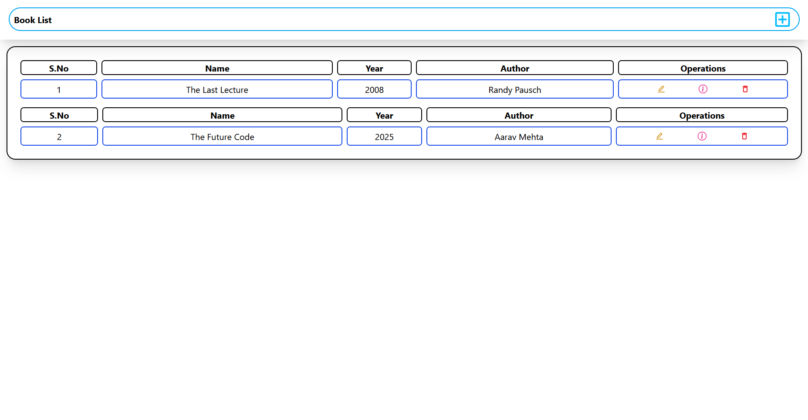
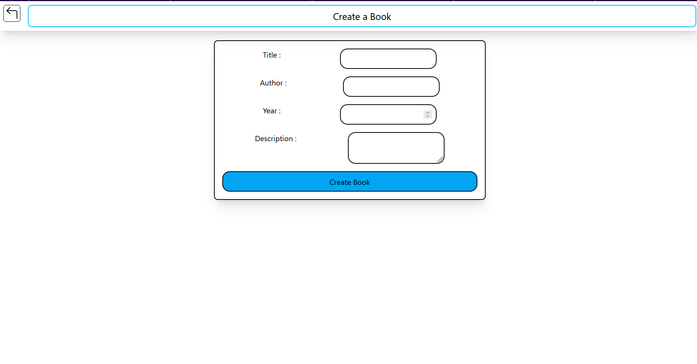
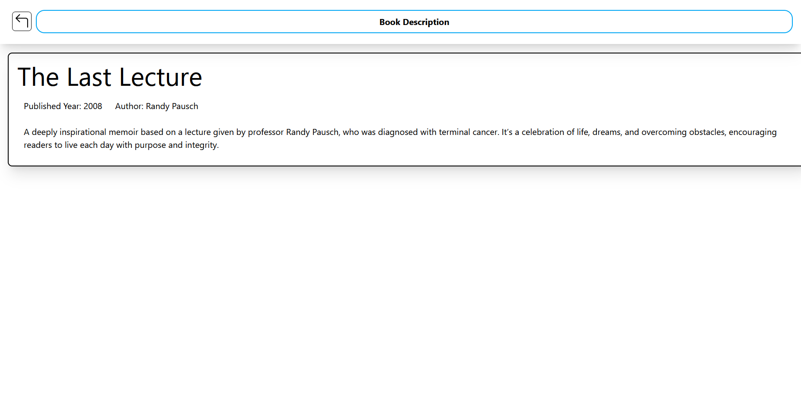

# 📚 Library Management System (MERN)  

The **Library Management System** is a simple CRUD web application built with the **MERN stack**. It allows users to efficiently manage books by adding, viewing, updating, and deleting records. This project demonstrates the fundamentals of full-stack development and database operations.  

---

## 🚀 Features  
- ➕ Add new books with details  
- 📖 View all available books  
- ✏️ Update existing book records  
- ❌ Delete books from the library  
- ⚡ Built with MERN for seamless frontend–backend integration  

---

## 🛠️ Tech Stack  
- **Frontend:** React, TailwindCSS  
- **Backend:** Node.js, Express.js  
- **Database:** MongoDB  

---

## 📂 Project Structure  
library-management/
├── client/ # React frontend
├── server/ # Node.js + Express backend
│ ├── models/ # Mongoose schemas
│ ├── routes/ # API routes
│ └── server.js # Entry point
├── README.md
└── .gitignore

## Screenshots

<p align="center">
  
  
  
</p>
---

## ⚡ Installation & Setup  

### 1. Clone the repo  
```bash
git clone https://github.com/your-username/library-management-system.git
cd library-management-system


cd server
npm install
npm start


cd client
npm install
npm start


```
